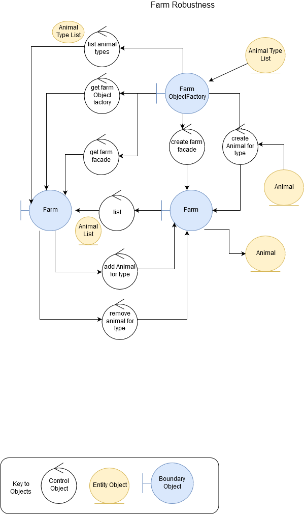
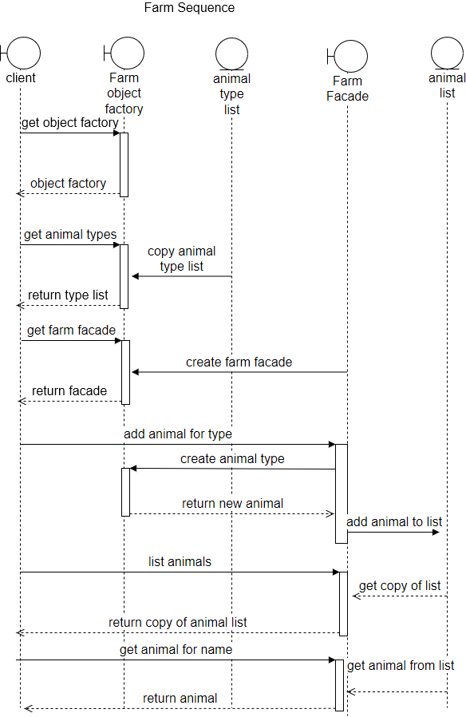

## Abstract Factory UML
The abstract factory pattern is a design pattern that allows for the creation of groups of related objects without the requirement of specifying the exact concrete classes that will be used. One of a number of factory classes generates the object sets.

The following is a diagram illustrating a simple factory

## Facade Pattern

Facade Pattern: Provide a unified interface to a set of interfaces in a subsystem. A Facade defines a higher-level interface that makes the subsystem easier to use.

Design patterns : elements of reusable object-oriented software
Gamma, Erich.; Helm, Richard.; Johnson, Ralph.; Vlissides, John.
1994

The following uml diagram extends the factory to include a facade. 

## More advanced Facade Pattern

A more advanced example is provided below which is implemented in the factoryandfacade2 project

## Use Cases and Robustness Diagrams

We can use draw.io https://www.draw.io/ to draw other UML diagrams such as Use Cases, Robustness diagrams and Sequence diagrams. 

The draw.io xml files and their related .png images are in the drawio folder. 

These are also referenced below;

Farm use case

Farm Robustness Diagram

Farm Sequence Diagram

